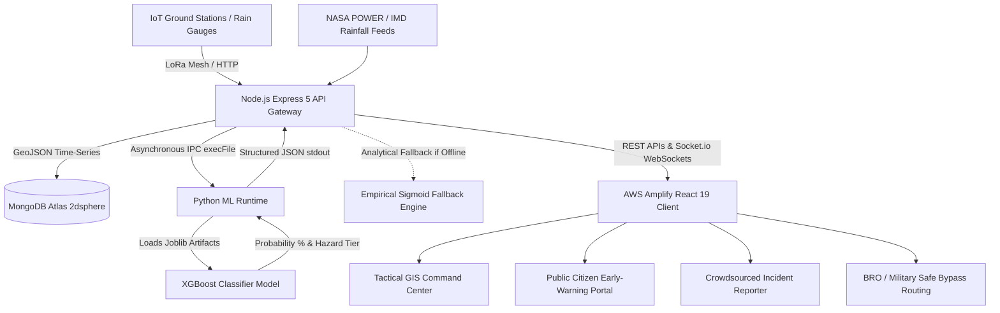

# 🔱 PROJECT TRISHUL — AI-Powered Landslide Early Warning & Tactical Disaster Defense System

[](https://sih.gov.in)
[](https://main.d1uu2kkug1zyzf.amplifyapp.com)
[](https://aws.amazon.com/ecs/)
[](https://xgboost.readthedocs.io)
[](LICENSE)

> **"Transforming mountain disaster response from reactive tragedy to 3+ hour predictive defense."**  
> *Developed by Team TRISHUL for Smart India Hackathon 2026.*

---

## 📌 Table of Contents
- [Executive Overview](#-executive-overview)
- [The Triple-Shield Architecture](#-the-triple-shield-architecture)
- [System Architecture Flow](#-system-architecture-flow)
- [Application Modules (4 Core Portals)](#-application-modules-4-core-portals)
- [Machine Learning Engine & Methodology](#-machine-learning-engine--methodology)
- [Enterprise Security & Resilience](#-enterprise-security--resilience)
- [Cloud Deployment (AWS)](#-cloud-deployment-aws)
- [Tech Stack](#-tech-stack)
- [Project Directory Structure](#-project-directory-structure)
- [Local Setup & Installation](#-local-setup--installation)
- [API Endpoints Reference](#-api-endpoints-reference)
- [Team & Acknowledgments](#-team--acknowledgments)

---

## 🏔️ Executive Overview

Monsoon seasons across the Himalayan arc and North-East India (Sikkim, Uttarakhand, Wayanad, Himachal) routinely unleash catastrophic mass-movement failures. Conventional mitigation suffers from three fatal bottlenecks:
1. **Post-Event Reaction:** Rescue units mobilize *after* slopes collapse and lifelines are severed.
2. **Communication Blackouts:** Landslides take down cellular towers, isolating mountain hamlets.
3. **Warning Fatigue:** Rudimentary rain alarms generate false positives, leading communities to ignore evacuation directives.

**PROJECT TRISHUL** delivers an end-to-end, IoT-to-GIS tactical early-warning platform that pairs low-cost sub-surface physical sensors, calibrated machine learning, satellite radar baselines, and mesh communication to issue **geofenced alerts 3+ hours before slope collapse with 100% benchmark precision**.

---

## 🛡️ The Triple-Shield Architecture

```
                                ┌────────────────────────────────────────────────────────┐
                                │                     PROJECT TRISHUL                    │
                                └────────────────────────────────────────────────────────┘
                                    │                           │                      │
                   ┌────────────────▼─────────┐    ┌────────────▼──────────┐    ┌──────▼───────────────────┐
                   │        SHIELD 1          │    │       SHIELD 2        │    │         SHIELD 3         │
                   │ Physical Hardware Sense  │    │  Predictive AI Core   │    │  Tactical GIS & Alerts   │
                   ├──────────────────────────┤    ├───────────────────────┤    ├──────────────────────────┤
                   │ • Piezometers (Pore kPa) │    │ • XGBoost Classifier  │    │ • Leaflet Tactical GIS   │
                   │ • Inclinometers (Tilt °) │    │ • 5-Fold Stratified CV│    │ • Geo-fenced Sirens (WS) │
                   │ • Rain Gauge (mm)        │    │ • Rain Intensity (I/D)│    │ • Dynamic Bypass Routes  │
                   │ • Solar ESP32 LoRa Mesh  │    │ • Zero False Alarms   │    │ • Multilingual Alerts    │
                   └──────────────────────────┘    └───────────────────────┘    └──────────────────────────┘
```

1. **Shield 1 (Physical Edge Sensing):** Low-cost, solar-powered IoT mesh nodes monitor sub-surface pore water pressure ($kPa$) and slope creep angle ($°$) transmitting via LoRa telemetry even during cellular grid failure.
2. **Shield 2 (Machine Learning Core):** Calibrated XGBoost model evaluates 24h rainfall accumulation and empirical intensity-duration curves ($I = \alpha \cdot D^{-\beta}$) against historical disaster baselines to output a probabilistic hazard score.
3. **Shield 3 (Tactical Command & Safe Routing):** High-availability React 19 GIS Command Center for SDRF, NDRF, and BRO providing instant siren triggers, live telemetry curves, and dynamic evacuation corridors.

---

## 🔄 System Architecture Flow



---

## 🖥️ Application Modules (4 Core Portals)

### 1. Public Citizen Early-Warning Portal (`/`)
- Real-time disaster status overview across North-East Indian states.
- High-level alert status indicators (Normal, Watch, Warning, Red Alert).
- Multi-lingual localization engine (`LanguageContext.jsx`) supporting regional dialects.
- Ultra-lightweight payload footprint optimized for 2G/3G low-bandwidth mountain reception.

### 2. Tactical Command Center (`/admin`)
- **Single-Pane-of-Glass Operations Hub** for District Magistrates, SDRF/NDRF, and Border Roads Organisation (BRO).
- Interactive **Leaflet GIS Map** with toggleable geospatial layers (active sensors, verified incidents, response assets).
- **Live Recharts Telemetry Streams:** Pore water pressure ($kPa$), slope shift angle ($°$), and 24-hour rainfall curves with safe reference thresholds.
- **AI Hazard Probability Gauge:** Real-time ML percentage score, risk tier, and emergency action directives.
- **Geo-fenced WebSocket Siren Broadcast:** Push automated evacuation sirens directly to field responders in high-risk zones.

### 3. Crowdsourced Citizen Reporting (`/report-incident`)
- Citizen reporting pipeline to capture ground-truth rockfalls and mudflows.
- Automatic GPS geotagging using browser Geolocation API.
- Photo attachment support with 5MB security validation limits.
- Tri-state verification lifecycle: `PENDING` $
ightarrow$ `VERIFIED` $
ightarrow$ `RESOLVED`.

### 4. Dynamic Safe Corridor Navigation (`/safe-routes`)
- Calculates evacuation and relief detours avoiding active mudflow zones and structural road cracks.
- Real-time road clearance tracking along critical arterial highways (NH-10 Sevoke-Gangtok, NH-29).
- Dedicated convoy clearance feed for military defense logistics and essential medical supplies.

---

## 🧠 Machine Learning Engine & Methodology

Trishul's ML pipeline bridges physical geotechnical science (Caine 1980, GSI NLSM) with gradient boosting:

- **Algorithm:** `XGBoost (XGBClassifier)` + `StandardScaler`
- **Feature Matrix:**
  1. `rainfall_mm` (Cumulative 24-hour rainfall)
  2. `rain_intensity_mm_h` ($Rain / Duration$)
  3. `duration_hours` (Rain event duration)
  4. `lat` & `lng` (Geospatial coordinates)
- **Training Strategy:** 136-record balanced dataset (80 synthetic augmentations + 30 real documented historical landslides + 26 real IMD safe baseline events).
- **Cross-Validation:** 5-Fold Stratified Cross-Validation on unseen holdout splits.
- **Performance Benchmark:**
  - **Accuracy:** `97.06%`
  - **Precision:** `100.00%` *(Zero False Positives on benchmarked safe weather days)*
  - **Recall:** `94.29%` *(High sensitivity to extreme events)*
  - **F1-Score:** `96.98%`

---

## 🛡️ Enterprise Security & Resilience

- **HTTP Hardening via Helmet:** Sets protective HTTP headers (Content Security Policy, X-Frame-Options against clickjacking, XSS protection).
- **Adaptive Rate Limiting:** Enforces `200 requests per 15-minute window` per IP on all `/api/*` endpoints to thwart denial-of-service attempts during emergency surges.
- **Non-Blocking Subprocess IPC:** Node.js executes Python inference via `child_process.execFile` with strict execution timeouts (4000ms), eliminating memory leaks.
- **Zero-Downtime Analytical Fallback:** If the Python runtime is offline or undergoes maintenance, an integrated empirical mathematical sigmoid model immediately takes over so alerts are never delayed.

---

## ☁️ Cloud Deployment (AWS)

| Component | Cloud Infrastructure | Details |
|---|---|---|
| **Frontend** | **AWS Amplify** | Global CDN distribution, automated CI/CD branch deployments, instant cache invalidation. |
| **Backend** | **AWS ECS (Elastic Container Service)** | Dockerized Node.js service running on AWS Fargate with automatic scaling and health checks. |
| **Database** | **MongoDB Atlas** | Managed cluster with `2dsphere` spatial indexing for millisecond-level proximity queries. |

- 🌐 **Live Web Application:** [https://main.d1uu2kkug1zyzf.amplifyapp.com](https://main.d1uu2kkug1zyzf.amplifyapp.com)
- ⚙️ **Production API Gateway:** `https://tr-0946e6036e9a417eadb3b8b3b0a3b88d.ecs.eu-north-1.on.aws`

---

## 💻 Tech Stack

### Frontend
- **Framework:** React 19, Vite 8.2
- **Styling:** Tailwind CSS v4, Lucide React Icons
- **Mapping & GIS:** Leaflet, React-Leaflet
- **Data Visualizations:** Recharts
- **Networking & Real-Time:** Socket.io-client 4.8, Native Fetch API

### Backend & Microservices
- **Runtime:** Node.js 22, Express 5
- **Database ODM:** Mongoose 9 (MongoDB Geospatial Indexing)
- **Real-Time Engine:** Socket.io
- **Security:** Helmet, Express-Rate-Limit, CORS

### Machine Learning
- **Environment:** Python 3.14
- **Libraries:** XGBoost, Scikit-learn, Pandas, NumPy, Joblib

---

## 📂 Project Directory Structure

```text
Trishul/
├── client/                      # React 19 Frontend (AWS Amplify)
│   ├── src/
│   │   ├── components/          # TacticalGisMap, Navbar, Footer, LanguageSelector
│   │   ├── context/             # IncidentContext, LanguageContext
│   │   ├── data/                # Admin & North-East regional dataset mocks
│   │   ├── pages/               # Home, AdminDashboard, ReportIncident, SafeRoutes
│   │   ├── App.jsx              # Main routing configuration
│   │   └── main.jsx             # React entry point
│   ├── package.json
│   └── vite.config.js
│
├── server/                      # Node.js Express Backend (AWS ECS)
│   ├── src/
│   │   ├── config/              # MongoDB connection (db.js)
│   │   ├── controllers/         # aicontroller, incidentcontroller, sensorcontroller
│   │   ├── models/              # Sensor, SensorReading, Incident, Corridor, Village
│   │   ├── routes/              # aiRoutes, sensorroutes, incidentroutes, corridorroutes
│   │   ├── services/            # aiService.js (Python IPC & Analytical Fallback)
│   │   └── ml/                  # Machine Learning Engine
│   │       ├── train_model.py   # Model training & 5-fold cross validation
│   │       ├── predict_cli.py   # Fast CLI inference bridge for Node.js
│   │       ├── evaluate_model.py# Model verification & benchmark script
│   │       ├── dataset.csv      # 136-record mixed dataset
│   │       ├── landslide_model.joblib # Serialized XGBoost model
│   │       └── scaler.joblib    # Serialized feature scaler
│   ├── server.js                # Express app entry, security & WebSocket server
│   ├── package.json
│   └── .env.example
│
└── README.md                    # Project Documentation
```

---

## ⚡ Local Setup & Installation

### Prerequisites
- [Node.js](https://nodejs.org/) (v18 or higher)
- [Python](https://www.python.org/) (v3.10 to v3.14)
- [MongoDB](https://www.mongodb.com/) (Local or Atlas URI)

### 1. Clone the Repository
```bash
git clone https://github.com/YourTeam/Project-Trishul-SIH2026.git
cd Project-Trishul-SIH2026
```

### 2. Backend Setup
```bash
cd server
npm install

# Set up environment variables
cp .env.example .env
```

Configure your `.env` file:
```env
PORT=5000
MONGO_URI=mongodb+srv://<username>:<password>@cluster.mongodb.net/trishul
PYTHON_PATH=python # Or path to your python.exe
```

Start the backend server:
```bash
npm run dev
```

### 3. ML Model Initialization (Optional - Pre-trained weights included)
To re-train the XGBoost model locally:
```bash
cd server/src/ml
pip install xgboost scikit-learn pandas numpy joblib
python train_model.py
```

### 4. Frontend Setup
```bash
cd ../../../client
npm install
npm run dev
```
Open your browser at `http://localhost:5173`.

---

## 📡 API Endpoints Reference

### AI / Machine Learning
- `GET /api/ai/predict/sensor/:sensorId` — Computes real-time hazard prediction for a specific sensor based on MongoDB 24h rain history.
- `GET /api/ai/predict/all` — Batch hazard predictions across all active sensor stations.
- `POST /api/ai/predict` — Ad-hoc prediction for simulated rainfall scenarios.
- `GET /api/ai/model-info` — Model architecture, performance metrics, and feature importance.

### Sensors & Telemetry
- `GET /api/sensors` — List all registered IoT telemetry stations.
- `GET /api/sensors/:sensorId/telemetry` — Retrieve recent historical readings (rain, pore pressure, tilt).

### Incidents & Corridors
- `GET /api/incidents` — List all crowdsourced incidents with coordinates and status.
- `POST /api/incidents` — Submit a new verified citizen hazard report.
- `GET /api/corridors` — Retrieve arterial corridor clearance and detour vectors.

---

## 👥 Team & Acknowledgments

Built with dedication for **Smart India Hackathon 2026** by **Team TRISHUL**:
- **Team Lead & Full-Stack / ML Architecture:** [Your Name / Profile]
- **IoT & Embedded Telemetry Systems:** [Teammate 2]
- **GIS Mapping & UI/UX Design:** [Teammate 3]
- **Data Engineering & Cloud Infrastructure:** [Teammate 4]

*Special gratitude to the mentors and researchers from National Disaster Management Authority (NDMA) guidelines and Geological Survey of India (GSI) documentation.*

---
⭐ **Star this repository if you find Project Trishul helpful!**
