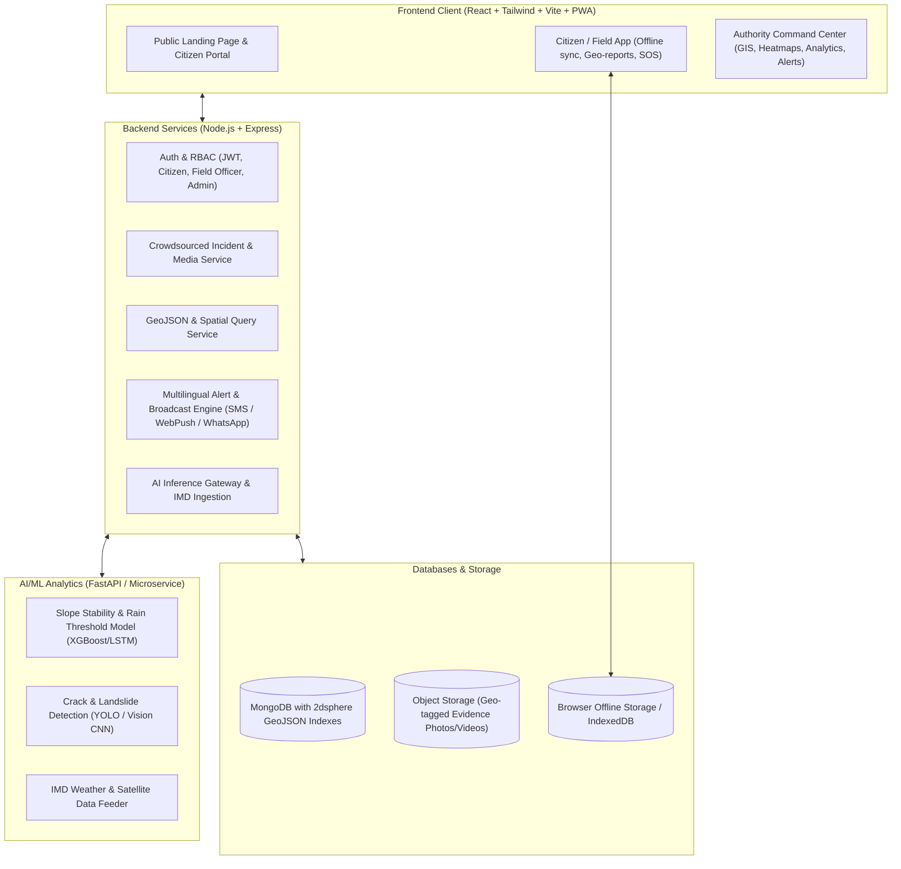

# Project Trishul: AI-Powered Real-Time Landslide Early Warning & Disaster Management System (NER)

## 1. System Architecture Overview

---

## 2. Technology Stack

### Frontend (Phase 1 - Current Focus)
- **Framework & Build Tool**: React 18 / 19 with Vite (Lightning fast HMR & minimal bundle).
- **Styling**: Tailwind CSS + Lucide-React icons + Framer Motion (for smooth micro-interactions & alert animations).
- **GIS & Interactive Mapping**: 
  - **Leaflet / React-Leaflet** with OpenStreetMap, Mapbox, and Bhuvan/ISRO satellite tile layers.
  - Heatmap layers (`leaflet.heat`) for real-time landslide risk visualization.
  - GeoJSON rendering for roads, vulnerable bridges, and isolated village boundaries.
- **Charts & Data Visualization**: Recharts / Chart.js for rainfall trends, soil moisture gauge charts, and risk severity indexes.
- **Offline & PWA Support**: 
  - Progressive Web App (Service Worker + Cache API).
  - `Dexie.js` / IndexedDB for offline geotagged incident draft storage with auto-sync when online.
- **State Management & Routing**: TanStack Query / React Context + React Router v6.
- **Multilingual Support**: `i18next` supporting English, Hindi, Assamese, Bengali, Mizo, Manipuri, etc.

### Backend & Database (Phase 2 - Upcoming)
- **Runtime & Server**: Node.js with Express.js (Modular MVC architecture).
- **Database**: MongoDB Atlas with native **2dsphere** geospatial indexing for lightning-fast radius searches (`$nearSphere`, `$geoWithin`).
- **Real-Time Communication**: Socket.io (for live incident broadcasting to admin dashboards and emergency sirens).
- **Messaging / SMS**: Twilio / Fast2SMS / Firebase Cloud Messaging (Web Push & emergency notifications).
- **Media Storage**: Cloudinary / AWS S3 for geo-tagged image uploads with EXIF metadata parsing.

### AI / Data Feeds (Future Integration)
- Python (FastAPI / Flask) running rainfall threshold prediction models (Antecedent Rainfall Index) and crack detection models.
- OpenWeather / IMD Weather API integrations.

---

## 3. Page-by-Page Feature Specifications

### 🏠 A. Front / Public Landing Page (`/`)
*Purpose: Inform the public, provide quick emergency action buttons, live regional status summary, and raise awareness.*
1. **Hero Section & Live Threat Ticker**:
   - Dynamic banner with current threat level across 8 North-Eastern states (Assam, Meghalaya, Sikkim, Arunachal Pradesh, Nagaland, Manipur, Mizoram, Tripura).
   - High-impact CTA: **"Report Hazard / Blocked Road"** and **"Emergency SOS / Safe Route Finder"**.
2. **Interactive Quick-Look Threat Map**:
   - Light interactive map showing active red/yellow alert zones across the NER.
3. **Live Weather & Disaster Advisories**:
   - IMD rainfall warning badges (Red/Orange/Yellow alert status).
4. **Key Pillars of Trishul**:
   - Explanation of AI Predictive early warning, Crowdsourced Field Reporting, Community offline sync, and Road Connectivity Monitoring.
5. **Emergency Helpline Directory**:
   - One-touch call buttons for SDRF, NDRF, District Disaster Management Authorities (DDMA), and Police.
6. **Multilingual Switcher & Voice Reader**:
   - Quick toggle between regional languages for accessibility.

---

### 📱 B. Citizen & Field Officer Portal (`/report` & `/citizen`)
*Purpose: Empower local citizens and field officials to report ground realities, check safe routes, and receive localized alerts even in low/no network.*
1. **One-Tap Geotagged Incident Reporter**:
   - Photo/video upload with automatic GPS capture, timestamp, and terrain tagging.
   - Hazard categorization: *Road Blockage, Slope Movement, Landslide, Active Mudflow, Structural Cracks, Flash Flood*.
   - Offline Queue: If connectivity drops, reports save locally in IndexedDB and automatically sync when connectivity resumes.
2. **Road Connectivity & Evacuation Safe-Route Navigator**:
   - Search source & destination to check if mountain highways (e.g., NH-29, NH-10) are clear or blocked.
   - Alternative safe-route recommendations avoiding high-slope hazard zones.
3. **Local SOS & Safe Check-In**:
   - "I Am Safe" broadcast to family/local authorities.
   - Offline SMS fallback for emergency distress signal with coordinates.
4. **Community Alerts Feed**:
   - Localized timeline of verified incidents and government notices.

---

### 🛡️ C. Administrator & Disaster Management Command Center (`/admin`)
*Purpose: Central command hub for District Magistrates, SDRF/NDRF, and BRO (Border Roads Organisation).*
1. **Comprehensive GIS Tactical Map**:
   - Multi-layer controls: 
     - 🔴 Landslide Risk Heatmap (AI-calculated using slope, rainfall, soil moisture).
     - 🚧 Live Road Blockages & Infrastructure Vulnerability.
     - 📍 Citizen-reported incidents (with unverified vs. verified statuses).
     - 🏥 Critical assets (Helipads, Relief camps, Hospitals, Equipment depots).
2. **Incident Triage & Verification Workflow**:
   - Review incoming crowdsourced reports with AI duplicate detection and image crack analysis score.
   - Actions: Verify, Dispatch Quick Response Team (SDRF/BRO), Issue Evacuation Order, Mark Resolved.
3. **AI Risk Prediction & Early Warning Studio**:
   - 72-Hour Rain vs. Landslide probability forecast curve.
   - Sensor telemetry dashboard (Piezo-sensors, Soil moisture, Rain gauges).
4. **Emergency Broadcast & Siren Control**:
   - Geo-fenced broadcast creator: Select a polygon on the map -> Compose alert -> Send Multilingual SMS/Push alerts to all users inside that polygon.
5. **Logistics & Resource Allocation Tracker**:
   - Track available excavators, JCBs, ambulances, and relief supplies near isolated villages.

---

## 4. Innovative Value-Adds for SIH (Smart India Hackathon)

1. **Offline-First PWA (Service Workers + IndexedDB)**: 
   - Essential for NER hills where landslides usually knock down cellular towers.
2. **AI Crowdsource Deduplication & Confidence Scoring**:
   - Automatically clusters reports occurring within 100m of each other to avoid spamming the admin.
3. **Isolated Village Resilience Score**:
   - Computes which remote village is at risk of total cutoff if a single mountain pass collapses.
4. **Dual Map Engine (2D GIS + Satellite Switcher)**:
   - Provides clear topological insights into steep slope gradients.

---

## 5. Phased Implementation Plan

- **Phase 1 (Now - Frontend UI & Interactive Prototyping)**:
  - Setup React + Tailwind + Vite project in `C:\Users\Lenovo\Desktop\Trishul`.
  - Install icons (`lucide-react`), mapping (`leaflet`, `react-leaflet`), charts (`recharts`), routing, and animation libraries.
  - Implement dynamic, realistic mock data for NER states, sensors, road statuses, and incident feeds.
  - Build **Landing Page**, **Citizen Reporting & Safe Route Finder**, and **Admin Command Center**.
  - Provide full offline report caching simulation and responsive design.

- **Phase 2 (After user review & break - Backend & Real Integration)**:
  - Initialize Node.js, Express, MongoDB schemas with GeoJSON indexes.
  - Connect Auth, REST API endpoints, and Socket.io for live updates.
